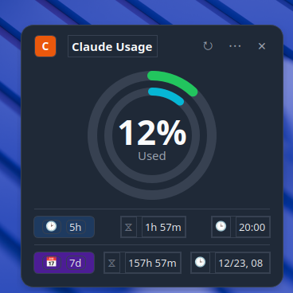

# Claude Usage Monitor

A Linux system tray application to monitor your Claude AI usage quotas. Shows 5-hour and 7-day usage with color-coded ring indicators.

Inspired by [Usage4Claude](https://github.com/f-is-h/Usage4Claude) for macOS.



## Features

- **Two tray icons** - 5-hour (green/orange/red) and 7-day (cyan/purple) usage rings
- **Popup window** - Click to see detailed usage with dual-ring progress indicator
- **Auto-refresh** - Updates every 5 minutes
- **Dark mode** - Toggle in settings
- **Autostart** - Launches on login
- **Portable** - Move the folder anywhere, it just works

## Installation

### Requirements
- Linux with a system tray (KDE Plasma, GNOME with AppIndicator extension, XFCE, etc.)
- Python 3.9+

### Quick Start

```bash
git clone https://github.com/endlessblink/time-to-claude.git
cd time-to-claude
./run.sh
```

The `run.sh` script automatically:
- Creates a Python virtual environment
- Installs PySide6 and dependencies
- Launches the app

## Setup

### Getting Your Session Key

1. Open [claude.ai](https://claude.ai) in your browser and log in
2. Press **F12** to open Developer Tools
3. Go to **Application** tab (Chrome) or **Storage** tab (Firefox)
4. Click **Cookies** > **claude.ai**
5. Find **sessionKey** and copy its value (starts with `sk-ant-sid01-...`)

### First Run

1. Click the tray icon to open the popup
2. Click the **...** menu > **Settings**
3. Paste your session key
4. (Optional) Enter your Organization ID from the URL
5. Click **Save**

## Usage

| Action | Result |
|--------|--------|
| Click tray icon | Open usage popup |
| Right-click tray icon | Context menu |
| Escape or X button | Close popup |

### Icon Colors

**5-Hour Usage (Left icon)**
| Color | Usage |
|-------|-------|
| Green | < 70% |
| Orange | 70-90% |
| Red | > 90% |

**7-Day Usage (Right icon)**
| Color | Usage |
|-------|-------|
| Cyan | < 70% |
| Purple | 70-90% |
| Deep Purple | > 90% |

## Autostart

The app automatically creates an autostart entry at:
```
~/.config/autostart/claude-usage-monitor.desktop
```

To disable autostart, delete this file.

## Configuration

Settings are stored in:
- Credentials: `~/.config/claude-usage-monitor/session.json`
- Preferences: `~/.config/claude-usage-monitor/settings.json`

## Troubleshooting

### App doesn't appear in system tray

- **KDE Plasma**: Should work out of the box
- **GNOME**: Install [AppIndicator extension](https://extensions.gnome.org/extension/615/appindicator-support/)

### Session key expired

Open Settings and paste a new session key from your browser.

### Shows 0% usage

Make sure you have an active Claude Pro or Team subscription.

## License

MIT License
